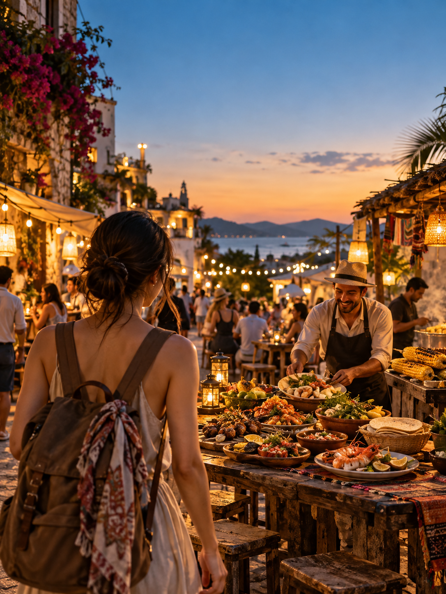

# 旅行计划为什么开始从“去哪玩”变成“去哪吃”？三份调查给出线索

作者：作者超哥

摘要：六国旅行调查显示，受访者给餐饮影响目的地选择的重要性打出平均 8.2/10。但这不等于景点失宠，更不意味着每家网红店都值得专程奔赴。

在旅行平台收藏景点，然后再搜索附近餐厅，是很多人熟悉的规划顺序。但另一种顺序也越来越常见：先刷到一份街头小吃，随后搜索这座城的车票、住宿和其他玩法。

这是普遍趋势，还是短视频放大的少数故事？几份 2026 年调查至少给出三个观察角度。

## 第一，餐饮已进入目的地选择

世界美食旅行协会在中国、法国、德国、墨西哥、英国和美国开展的《Food Travel Monitor 2026》显示，受访休闲旅行者给“食物和饮料对目的地选择的重要性”打出平均 8.2 分，满分 10 分；66% 认为餐饮比五年前更影响自己的旅行。

这个数字不是“八成人只为吃而旅行”。问卷测量的是重要性，不是唯一决定因素。机票价格、假期长度、同行者需求和景点仍然会影响最终选择。更准确的说法是：食物从旅途中顺便解决的需求，变成了出发前就会考虑的体验。

## 第二，短视频把“想吃”提前到出发之前

美国运通旅行发布的《2026 Global Travel Trends Report》覆盖七个市场，受访者还须满足一定收入与出游频率条件。其中，超过四分之三的千禧一代和 Z 世代受访者表示，旅行时可能去寻找社交媒体爆火的食物；89% 认为行程中应为当地小吃留出空间。

这不能代表所有年龄层、所有收入群体，也不能证明短视频单独造成了旅行决策。但它解释了一个常见动作：先在手机上对某种味道产生期待，再把那家店纳入路线。

一条内容想让人看完，往往不只展示“很好吃”，而是提供一个能验证的问题：固定预算能吃到什么？两家店同一道菜差在哪？凌晨的市场是谁的早餐？这些问题把食物、人物和地点连成了故事。

## 第三，旅行者想要的并非只有网红店

美国餐饮协会对 1,000 多名消费者的 2026 年夏季旅行调查显示，在其美国国内夏季旅行受访者中，79% 想体验当地菜，88% 计划尝试没有去过的餐厅。调查场景仅限美国国内夏季旅行，不能外推成全球结论。

“当地菜”和“爆款美食”有交集，却不是同一件事。前者可能藏在市场、社区面包店和普通家庭餐馆；后者更容易被算法反复展示。把两者混为一谈，旅行就容易变成排队复刻一条视频。

对准备出行的人，更实用的办法是把热门内容当线索：核对近期营业与菜单，计算绕路成本，再找当地评价和其他独立来源。一个可靠的美食旅行推荐，也应说明价格、拍摄时间、候位情况和体验边界。

所以，景点并没有被餐桌取代。变化在于，旅行者更愿意用一种具体味道打开一座城，再由街道、店主和日常生活决定这段旅程是否值得。

如果只能给一段周末行程定一个主题，你会先选地标，还是先选一道菜？

资料与样本说明见随稿《来源与口径.md》。资料核对日期：2026 年 9 月 29 日。
